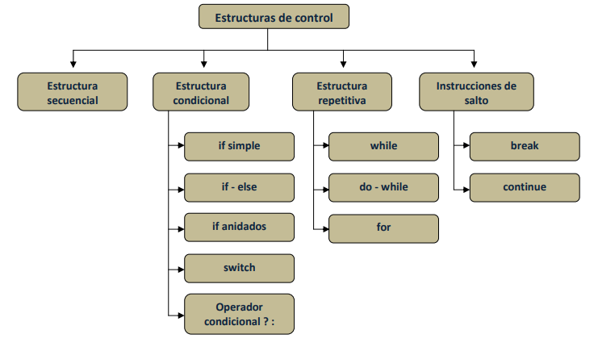

### Requerimientos formales

Deberá tener al menos los siguientes apartados:

 - Título principal
 - Títulos secundarios: descripción, instalación, uso, características, tablas, listas, etc.
 - Una lista de tareas pendientes
 - Una tabla con al menos dos columnas y dos filas
 - Al menos una imagen
 - Un bloque de código formateado
 - Enlaces de webs externas


 ## PROGRAMACIÓN EN JAVA

 ### Estructuras de control en Java
 Los programas contienen instrucciones que se ejecutan generalmente una a continuación de la otra según la secuencia en la que el programador ha escrito el código.  Sin embargo, hay ocasiones en las que es necesario romper esta secuencia de ejecución para hacer que una serie de instrucciones se ejecuten o no dependiendo de una determinada condición o hacer que una serie de instrucciones se repitan un número determinado de veces.

Las estructuras de control permiten modificar el orden natural de ejecución de un programa. Mediante ellas podemos conseguir que el flujo de ejecución de las instrucciones sea el natural o varíe según se cumpla o no una condición o que un bloque de instrucciones se repitan dependiendo de que una condición se cumpla o no. 

Las estructuras de control se dividen en las siguientes categorías:
- Estructura Secuencial
- Estructura Condicional o Selectiva
- Estructura Iterativa o Repetitiva.
- Instrucciones de salto 

La siguiente imagen muestra todas las estructuras de control del lenguaje Java


### Estructura secuencial
La estructura secuencial es el orden natural de ejecución. Las instrucciones que componen esta estructura se ejecutan en orden una a continuación de la otra.

La mayoría de las instrucciones están separadas por el carácter punto y coma (;).
 
Las instrucciones se suelen agrupar en bloques.
El bloque de sentencias se define por el carácter llave de apertura ({) para marcar el inicio del mismo, y el carácter llave de cierre (}) para marcar el final.

Ejemplo de bloque de instrucciones:
```
int n = 1;

int m = 0;

m = n++ ;

System.out.println(m);

System.out.println(n); 
```


