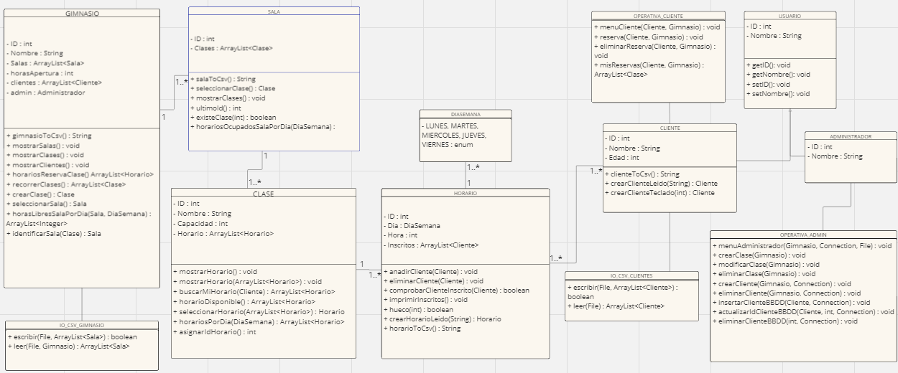

 # PROYECTO

 ## APLICATIVO GIMNASIO 
 ### DESCRIPCION
 La aplicación desarrolla un software donde se proporcionan diversas herramientas para los usuarios del software, tanto para los clientes como para el administrador responsable. Ambos tienen funcionalidades distintas en el mismo aplicativo.

### FUNCIONALIDAD
Puede ser utilizada tanto por los clientes del gimnasio como por el administrador responsable, ambos tendrán acceso a diversas funcionalidades asociadas a sus roles en la aplicación. 

Por un lado, se busca que los clientes inscritos puedan realizar consultas sobre las clases y sus correspondientes horarios así como las clases en las que el cliente ha realizado reservas previamente. Así mismo la aplicación busca ofrecer al usuario una forma intuitiva de gestionar sus reservas. El cliente podrá listar las clases existentes y sus horarios asociados, realizar reservas, cancelar las mismas y consultar un listado con todas las reservas que este cliente haya realizado.

Por otro lado, se propone otorgar y facilitar al administrador designado tareas relacionadas con la gestión de clases y clientes. El administrador podrá crear y eliminar clases, añadir nuevos horarios a las clases existentes, dar de alta clientes y eliminarlos del registro.


### HERRAMIENTAS UTILIZADAS
- NetBeans
- Xampp
- Git

### DIAGRAMA DE CLASES UML

https://miro.com/app/board/uXjVKQhUIz8=/?share_link_id=70963753547

### CONTENIDO ADICIONAL IMPLEMENTADO
| Enumerados | | Se implementaron para tener días fijos en los días de la semana|
|------------| |--------------|
| Etiquetas  | | Se utilizan cuando se trabajan con bucles anidados para controlar el flujo de ejecucion|

**Ejemplo de como utilizar las etiquetas**
```
etiqueta: for (int i = 0; i < 3; i++) {
    for (int j = 0; j < 3; j++) {
        if (i == 1 && j == 1) {
            break etiqueta; // Sale del bucle etiquetado con "etiqueta"
        }
        System.out.println("i = " + i + ", j = " + j);
    }
}
```


### TAREAS PENDIENTES
- [x] Terminar el código
- [ ] Implementar el contenido adicional
- [x] Conectar con la base de datos
- [x] Harcodear algunos usuarios para testear